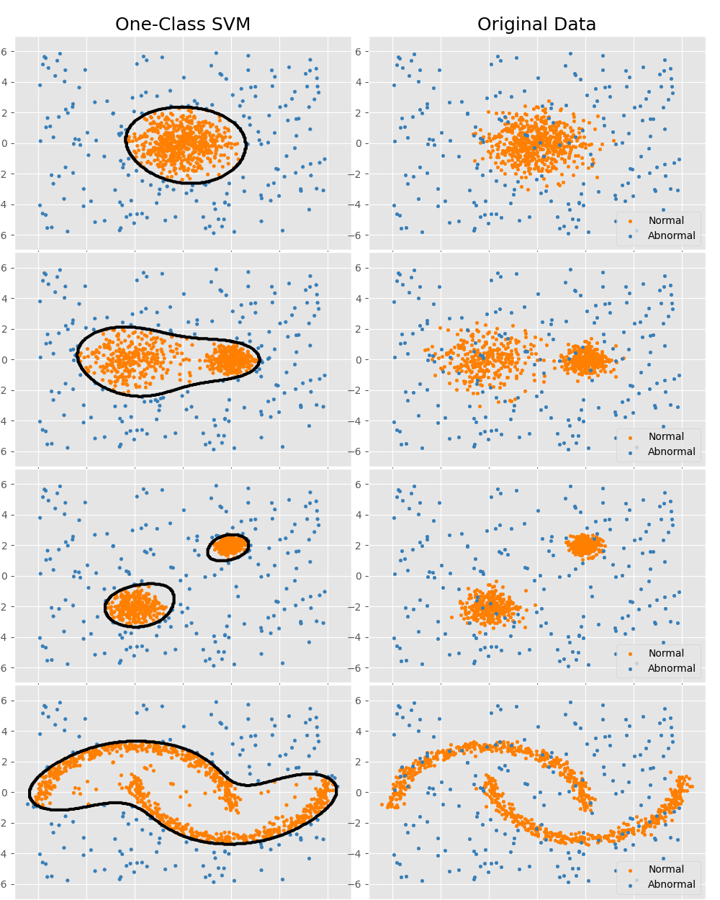

# Task for Internship

## Task requirements
- Create a synthetic dataset containing normal and abnormal signals.
- Training a model for detecting normal and abnormal signals using only normal signals

## Solution
- Model: one class SVM
    - Unsupervised learning
    - Learns the feature of normal data, thus we don't need the abnormal data in the training phase
    - Best suited for novelty detection when the training set is not contaminated by outliers.
- Synthetic dataset:
    - Normal data: generated using sklearn's make_moons and make_blobs.
    - Abnormal data: generated using sklearn's RandomState with uniform distribution.
    >RandomState exposes a number of methods for generating random numbers drawn from a variety of probability distributions. 
- Baseline
    - Generate synthetic dataset
    - Training the model with normal data
    - Add abnormal data to the normal data
    - Validation by classifying the points from the concatenated dataset

## Repo Requierments
- Scikit-Learn
- Numpy
- Matplotlib

## Result

- On the left
    - The orange points are detected as normal points
    - The blue points are detected as abnormal points
- On the right
    - The orange points are normal points
    - The blue points are detected as abnormal points

## References
- https://scikit-learn.org/0.20/auto_examples/plot_anomaly_comparison.html